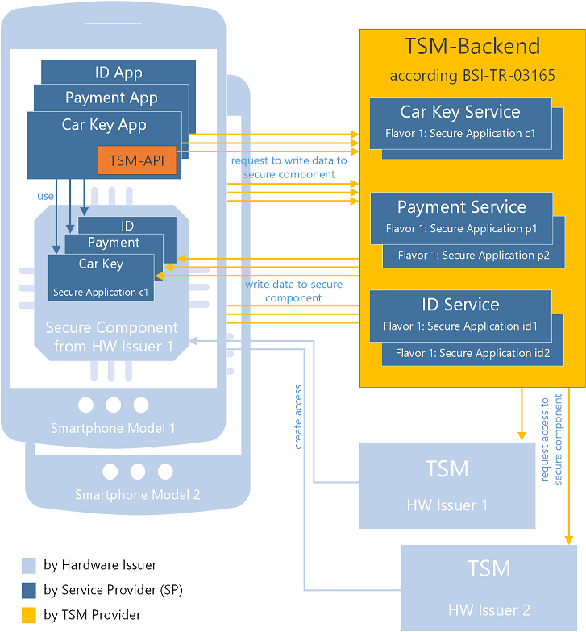

# TSMS - Trusted Service Management System 

Last updated: 08.07.2022

The *GitHub-BSI-TSMS* project is a collection of source code modules to implement the interfaces specified in [BSI-TR-03165](https://www.bsi.bund.de/DE/Themen/Unternehmen-und-Organisationen/Standards-und-Zertifizierung/Technische-Richtlinien/TR-nach-Thema-sortiert/tr03165/tr-03165.html).

Content:

<ol>
  <li><a href="README.md#motivation">Motivation</a></li>
  <li><a href="README.md#project_results">Project Results</a>
    <ol>
      <li><a href="tsm-api/README.md">TSM-API</a></li>
      <li><a href="tsm-rest-api/README.md">TSM-REST-API</a></li>
	</ol>
  </li>
  <li><a href="README.md#documentation">Documentation</a></li>
  <li><a href="README.md#faq">FAQ</a>
 </li>
</ol>

*Attention: in case of conflicts between GitHub-BSI-TSMS and BSI-TR-03165, information specified in BSI-TR-03165 always have higher priority.*

## 1. Motivation

Nowadays, smartphones are often used for apps with high security demand, e.g. car keys, ID, payment, and ticketing. Using secure components, usually called "secure components" in this context, can increase security of those apps. The technology of secure components is similar to smart cards - a JavaCard applet is installed on a secure component, and the app on the smartphone can use it to handle sensitive data. 

Due to high security demands, access to those secure components is highly restricted. After production, only the issuer of the chip can access it. To use the secure component, the app provider must gain access to each dedicated chip from its issuer. Additionally, each chip must be prepared to support the needs of the app by
* installing customized JavaCard applet(s) with app specific functionality on the secure component
* personalizing the JavaCard applet(s) with user specific private keys and other sensitive data

The simplest approach is to install and personalize the secure component already during production. But that would mean user specific data must already be stored during production on the secure component. This is a common approach for  smart cards and security tokens, but in the context of smartphones or IOT devices this is hardly possible.

Another approach is to pre-install standardized JavaCard applets on the smartphone and personalize them later in the field. Besides increasing effort in some fields, a world-wide standardization of applets for ID, ticketing, payment and other use cases is still lacking. Instead, the implementation of those applets is usually controlled by the smartphone issuer, which leads to a lack of control about the security implementation details and supported functionality for specific use cases.

A third approach is to install and personalize a secure component dynamically in the field. This is a powerful approach, but is also complicated. Due to bad cyber resilience of smartphone apps, the smartphone OS itself is not allowed to modify the secure component. Instead, the app needs to trigger a Trusted Service Manager (TSM) to install and, if applicable, personalize the secure component. The TSM guarantees that only the app provider gets full control to a restricted area on each secure component in the field, but it requires a relatively complex infrastructure. Thus, setting up a dedicated TSM for a specific application is not very effective. A TSM is best seen as a central component in a TSM-System (TSMS), which consists of one (or multiple) TSMs, multiple apps and app providers covering a variety of use cases, and a multitude of secure component issuers to ensure considerable market coverage. 

The BSI-TR-03165 describes a TSMS which simplifies the third approach by keeping its flexibility. In particular, it
* provides a non-discriminating access to secure components,
* allows full control about JavaCard applets installed and used,
* simplifies the API to install and uninstall JavaCard applets on secure components of smartphones,
* encapsulates the APIs of different issuers, 
* supports different kinds of secure components with one API,
* allows handling of sensitive data without forwarding it to software or hardware vendors or other third parties.

## 2. Project Results

The *GitHub-BSI-TSMS* project consists of several modules. Each module contains resulting build artifacts which can be used to implement or use a TSM according to BSI-TR-03165.

It contains the following modules:

* [**tsm-api**](tsm-api/README.md)
  * Java library which defines the TSM-API according to *BSI-TR-03165*
  * can be used to implement a TSM-API-SDK 
  * can be used to implement a client which uses a TSM-API-SDK to install JavaCard applets on smartphones
* [**tsm-rest-api**](tsm-rest-api/README.md)
  * OpenAPI definition for a REST-API to TSM-Backend according to *BSI-TR-03165*
  * can be used to implement a TSM-Backend REST-API
  * can be used to implement a client to configure a TSM-Backend
  

## 3. Documentation

### 3.1 Usage

The following steps describe the workflow how to use secure components according to BSI-TR-03165:
 

1. Create app specific JavaCard applets  
   
 After production, a secure component just contains an operating system and some basic administration tools. The secure component must be programmed to support certain use cases - e.g. ID use case, DL use case, payment use case. Here for, the app provider must first develop a JavaCard applet implementing the security functionality to protect the sensitive data needed by the app.  

2. Upload JavaCard applets to TSM-Backend  
   
 BSI-TR-03165 describes a TSM-Backend service operated by a third party to install and configure secure components. This TSM-Backend requires an administration interface to upload app specific JavaCard applets or to configure other installation properties.  
  The module [**tsm-rest-api**](tsm-rest-api/README.md) contains an API specification describing an interface to administrate a TSM-Backend.  

3. Install JavaCard applets on a secure component on a smartphone  
   
 Since a smartphone app is not allowed to install data on secure components by itself, it needs to trigger a TSM to install JavaCard applets. According to the concept presented in TR-03165, the smartphone app uses a library called TSM-API-SDK to trigger a TSM operated by a third party to manage the installation process.  
 The module [**tsm-api**](tsm-api/README.md) contains a Java API to install and uninstall JavaCard applets.  
  
 
4. Create a smartphone app to use JavaCard applets  
   
 Last step is to use the JavaCard applet on the secure component of the smartphone to protect app specific sensitive data. This app can use the standard OMAPI interface provided by Android devices on default to access the applet. 

### 3.2 Components and Interaction

**<em>Terminology:</em>** BSI-TR-03165 describes a Trusted Service Management System (TSMS) to manage the lifecycle of secure applications on secure components. In practice, secure applications are JavaCard applets and secure components are usually secure components like Secure Elements or eUICCs. Managing lifecycle means to install, configure and uninstall such secure applications. So the TSMS is an infrastructure to install, configure and uninstall JavaCard applets on Secure Elements or eUICCs. 

The TSMS consists of multiple Trusted Service Managers (TSMs):
<ul>
<li>An SEI TSM (Secure Component Issue Trusted Service Manager) provided by the issuer of the secure component. This TSM holds the keys necessary for general access to the secure component. This TSM is allowed to grant reading and writing access to the secure component. </li>
<li>An SP TSM (Service Provider Trusted Service Manager) which has a contract with the issuer of the secure component. It can trigger the SEI TSM to get access to a concrete secure component. With this access, the SP TSM can trigger installation of custom secure applications.
</ul>

**<em>Concept:</em>** The idea of BSI-TR-03165 is to offer an SP TSM as a third-party service which directly can be used by smartphone apps. With this, the app provider does not need to operate its own SP TSM and instead uses the third-party SP TSM service.

**<em>Components:</em>** The third-party SP TSM provider offers a TSM-API-SDK, which must be integrated into the smartphone app. The library offers methods to trigger installation, update and uninstallation of JavaCard applets. It uses the TSM-API interface to communicate with a TSM-Backend server system operated by the third-party SP TSM provider. The TSM-Backend holds all the JavaCard applets needed, when necessary also for different kind of hardware variants, called Flavors. The app provider can upload and configure all his applets via a TSM-Backend REST-API. 

**<em>Interaction:</em>** The smartphone app calls a method from the TSM-API to start the installation process. The TSM-API-SDK forwards this request to the TSM-Backend system. The TSM-Backend forwards the request to the proper SEI TSM to create a security domain (SD) on the secure component of the device. When the SD is created, the TSM-Backend chooses the  JavaCard applet(s) suitable and installs it on the device. The smartphone app then can either personalize the applet with user data directly after installation or later when needed via the TSM-API. It is also possible to personalize the applet with SCP03 protocol via an SP backend system without involving the TSM. 

 

## 4. FAQ

1. <em>Which types of secure components are already supported?</em> 
At the moment, only SecureElements (SE) are supported. It is planned to support eUICC next.

2. <em>Which types of secure applications are already supported?</em> 
At the moment, only JavaCard applets are supported. Theoretically it shall also be possible to support MULTOS, but this is currently not planned.

3. <em>How can personalization of the applet with user data be done without the TSM?</em> 
For a SP, it is possible to directly personalize the applet via [SCP03 protocol](https://globalplatform.org/wp-content/uploads/2014/07/GPC_2.3_D_SCP03_v1.1.2_PublicRelease.pdf) without the need to directly involve the third-party TSM. However, this requires the exchange of the necessary cryptographic keys, respectively the exchange of a master key and key diversification data for key generation, between SP and TSM in advance. For highest security approach, a HSM shall be used for the key generation on both sides. The TR-03165 provides a mechanism for the exchange of key diversification data (via the attestation token), the exchange of a master key is not in the scope of the TR. 

4. <em>Can TSMS also be used for IOT devices?</em> 
Yes, the TSMS concept described in BSI-TR-03165 could also be used for IOT devices. However, it is not directly designed for or focused on this case.

5. <em>Is the TSMS the optimal solution to access secure components?</em> 
There are multiple options to access secure components and each one has pros and cons: 

|*Options*|*Pro*|*Contra*|
|:----|:-------------|:-------------|
|*Option A:* preinstalled, applet provided by service provider|+ high control about implementation details + simple, no installation in field needed|- low device coverage|
|*Option B:* preinstalled, applet provided by smartphone issuer|+ high device coverage + simple, no installation in field needed|- missing control about  implementation details|
|*Option C:* installation in field via SP|+ high control about implementation details |- complex, installation in field needed - low device coverage|
|*Option D:* installation in field via BSI-TR-03165|+ high device coverage achievable + high control about implementation details|- complex, installation in field needed|
