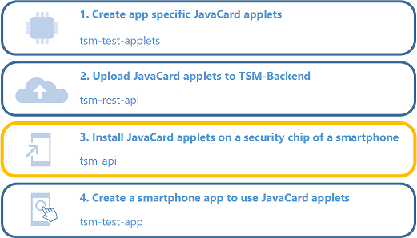
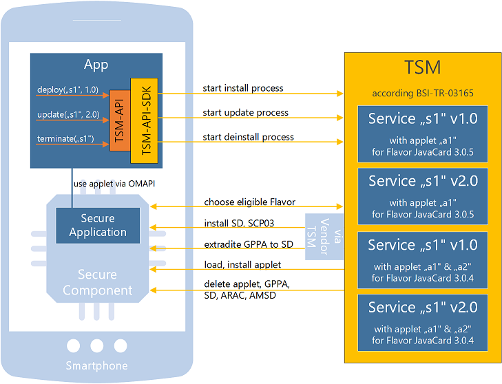

# TSM-API 

*Last updated: 07.06.2022*

The module **tsm-api** is a Java realization of the TSM-API specified in section 4.2 of [BSI-TR-03165](https://www.bsi.bund.de/DE/Themen/Unternehmen-und-Organisationen/Standards-und-Zertifizierung/Technische-Richtlinien/TR-nach-Thema-sortiert/tr03165/tr-03165.html). It is a submodule of [GitHub-BSI-TSMS](../README.md).

Content:

<ol>
  <li><a href="README.md#motivation">Motivation</a></li>
  <li><a href="README.md#project_results">Project Results</a></li>
  <li><a href="README.md#documentation">Documentation</a>
    <ol>
      <li><a href="README.md#project_structure">Project Structure</a>
      <li><a href="README.md#setup_development_environment">Setup Development Environment</a></li>
      <li><a href="README.md#life-cycle">Life-cycle Process</a></li>
      <li><a href="README.md#api_methods">API Method Overview</a></li>
      <li><a href="README.md#prerequisites">API Prerequisites</a></li>
      <li><a href="README.md#initialize">Initialize the TSM-API-SDK</a></li>
      <li><a href="README.md#deploy">Install JavaCard Applet(s)</a></li>
      <li><a href="README.md#update">Update JavaCard Applet(s)</a></li>
      <li><a href="README.md#uninstall">Uninstall JavaCard Applet(s)</a></li>
    </ol>
  </li>
</ol>

*Attention: the **tsm-api.jar** is just a collection of interfaces and simple data transfer objects (DTO). It does not contain the concrete TSM implementation needed to install applets on secure elements.*

<a name="motivation"></a>
## 1. Motivation

The TSM-API is an interface that defines methods to trigger life-cycle management processes of secure
applications on secure components. This module provides a Java library **tsm-api.jar** of the TSM-API interface described in BSI-TR-03165. Together with a third-party TSM-API-SDK implementation of the tsm-api, it can be used to:
* install JavaCard applets on eSE
* update to new version of an JavaCard applet on eSE
* remove JavaCard applet from eSE
* perform device check for eligibility of a smartphone (check available eSE)

Installing JavaCard applets on a secure component of a smartphone is step three in the usage path of BSI-TR-03165.




<a name="project_results"></a>
## 2. Project Results

The resulting build artifacts of this module are:

* **[tsm-api-1.0.0.jar](dist/1.0.0/tsm-api-1.0.0.jar)**
  * can be included into an Android app to use a TSMS by calling TSM-API methods
  * provide default implementations for all data types required by the TSM-API
  * can be used to implement a TSM-API-SDK according to BSI-TR-03165 
* **[tsm-api-1.0.0-javadoc.jar](dist/1.0.0/tsm-api-1.0.0-javadoc.jar)**
  * JavaDoc documentation of the TSM-API interfaces, enums and classes
* **[tsm-api-1.0.0-sources.jar](dist/1.0.0/tsm-api-1.0.0-sources.jar)**
  * source code of the TSM-API


<a name="documentation"></a>
## 3. Documentation

<a name="project_structure"></a>
### 3.1 Project Structure

This project is a Maven Java project and is structured as follows:

|**Folder**|**Description**|
|:----------|:----------|
|[<em>dist/</em>](dist/)|Contains resulting build artifacts of the project in several versions.|
|<em>javadocs/</em>|Generated when building the project. It contains the extracted JavaDoc HTML documentation of the TSM-API.|
|[<em>src/main/java/</em>](src/main/java/)|Contains Java source code files of the TSM-API.|
|<em>target/</em>|Generated when building the project. It contains temporary build files created by Maven.|


<a name="setup_development_environment"></a>
### 3.2 Setup Development Environment  

Perform the following steps to set up a development environment to build the project.
 
1. Install Java Development Kit >= 1.8.0
 
2. Install Apache Maven >= 3.0.0

3. Build the maven project
  ```
  mvn clean install
  ```

*Attention: Actually, it is not needed to build this project. All final artifacts are available inside the [dist](../../dist) folder.*


<a name="life-cycle"></a>
### 3.3 Life-cycle process
When executing a life-cycle operation from the TSM-API, the TSM-API-SDK starts a new process, which is then executed by the corresponding TSM server. 
For all processes, the smartphone app needs no direct connection to the vendor of the secure component. Instead, the TSM according to BSI-TR-03165 supports multiple vendors and passes the life-cycle requests to the suitable hardware issuer. The main life-cycle processes are deployService, updateService and terminateService and are defined as follows:

*deployService:*
  * the TSM performs an eligibility check and chooses an applet from TSM-Backend matching the underlying hardware variant 
  * the TSM triggers the issuer of the secure component to first install a Security Domain (SD) for the TSM itself
  * then the TSM creates a supplementary SD (SSD) for the app and installs the app specific JavaCard applet(s)

*updateService:*
  * the TSM checks the current installation status and chooses an eligible  JavaCard applet(s) for update 
  * the TSM removes applet(s) of outdated versions; in case applet(s) are not modified, they will not be removed
  * then the TSM installs the new version of the applet(s)

*terminateService:*
  * the TSM checks the current installation status
  * the TSM removes the app specific JavaCard applet(s) 
  * then the TSM removes the SD of the app 
  * when no other TSM services are installed, the TSM SD is removed also
  



<a name="api_methods"></a>
### 3.4 API Method Overview
The interface [ITsmApiService](src/main/java/de/bsi/tsms/tsmapi/ITsmApiService.java) is the main entry point to use the tsm-api.jar. It contains all methods to install, update and uninstall JavaCard applets and apart from that, it offers some additional supporting operations. The following table lists all methods of the TSM-API:

| *Method*                            | *Description*                                                                                                                                                               |
|:------------------------------------|:----------------------------------------------------------------------------------------------------------------------------------------------------------------------------|
| createServiceInstance(..)           | Instantiate a Service with the given ID and Version Tag on a SC selected by the eligibility check. It returns the created Service Instance.                                 |
| getServiceInstances(..)             | Get the existing Service Instances for a given Service ID.                                                                                                                  |
| checkServiceDeploymentAvailable(..) | Check for a Service if there is at least one secure component accessible on the handset for which a deployment can be requested.                                            |
| checkServiceUpdateAvailable(..)     | Check for a Service Instance if there is an update that can be requested.                                                                                                   |
| deployService(..)                   | Install a Service and its JavaCard applet(s) on a smartphone. Prerequisite: the JavaCard applets matching to the smartphone hardware must be configured in the TSM-Backend. |
| updateService(..)                   | Remove old and install new version of JavaCard applet(s) configured in the TSM-Backend.                                                                                     |
| suspendOrResumeService(..)          | Disable or enable the main JavaCard applet on the smartphone.                                                                                                               |
| terminateService(..)                | Remove a Service and its JavaCard applet(s) from the smartphone.                                                                                                            |


<a name="prerequisites"></a>
### 3.5 Prerequisites

The following prerequisites are needed to use the TSM-API:

1. A concrete implementation of the TSM-API (TSM-API-SDK) must be available beside the tsm-api.jar. Such a TSM-API-SDK is not part of the GitHub-BSI-TSMS and must be obtained from third-party.<br><br>
  

2. A smartphone app and smartphone specific JavaCard applet(s) must be created and uploaded to the TSM-Backend via the [tsm-rest-api](../tsm-rest-api/README.md).<br><br>
  The following minimal configuration is needed:
    |**Entity**|**Description**|
    |:----------|:----------|
    |ExecutableLoadFile|A JavaCard applet must be uploaded as ExecutableLoadFile to the TSM-Backend system.|
    |ApplicationConfig|An ApplicationConfig must be created to configure install, activate and personalize tasks for the uploaded JavaCard applet|
    |Service|A Service, which is representing the service of the smartphone app, must be created. The SERVICE_ID defined here is then used in the TSM-API as parameter to install, update and uninstall JavaCard applet(s) on a smartphone, see [3.7](README.md#deploy), [3.8](README.md#update) and [3.9](README.md#uninstall).|
    |Flavor|A Flavor must be created. The uploaded JavaCard applet together with the created ApplicationConfig must be linked to the Flavor.|
    |Version|An initial Version must be created for the new JavaCard applet. The Flavor and by the JavaCard applet supported SecureComponentProfiles must be linked to this Version. The VERSION_TAG defined here is then used in the TSM-API as parameter to install concrete JavaCard applet(s) on a smartphone, see [3.7](README.md#deploy).|


<a name="initialize"></a>
### 3.6 Initialize the TSM-API-SDK
The initialization of the TSM-API-SDK highly depends on the specific implementation details. The code snippet below shows the source code needed to initialize an TSM-API-SDK when Android Service binding is used. 

```java
    import android.content.ComponentName;
    import android.content.Context;
    import android.content.Intent;
    import android.content.ServiceConnection;
    import android.os.IBinder;
    import android.util.Log;

    import de.bsi.tsms.tsmapi.ITsmApiService;
    import your.tsm.provider.TsmApiServiceImpl;
    
    ...
   
    Context context = this;
    ITsmApiService tsmApiService = null;
    
    // initialize ITsmApiService implementation from TSM-API-SDK via Android service binding
    ServiceConnection connection = new ServiceConnection() {
        public void onServiceConnected(ComponentName className, IBinder service) {
            Log.d(TAG, "onServiceConnected: started");

            TsmApiServiceImpl.LocalBinder binder = (TsmApiServiceImpl.LocalBinder)service;
            tsmApiService = binder.getServiceManager();
        }

        public void onServiceDisconnected(ComponentName arg0) {
            Log.d(TAG, "onServiceDisconnected: started");
        }
    };
    // bind the Android service
    context.bindService(new Intent(context, TsmApiServiceImpl.class), connection, Context.BIND_AUTO_CREATE);
    
    ...
```

<a name="deploy"></a>
### 3.7 Install JavaCard applet(s)
To install a JavaCard applet, the app must call the TSM-API method *deployService*. The following algorithm could be used to start the deployment. Hereby, the parameters SERVICE_ID and VERSION_TAG must be taken from the TSM-Backend configuration, see [3.5](README.md#prerequisites). 

1. Check for existing service instances on this smartphone:<br>
      ```serviceInstances = getServiceInstances(SERVICE_ID)```
2. Check if a secure component is available for deployment:<br>
      ```eligible = checkServiceDeplomynetAvailable(SERVICE_ID, VERSION_TAG)```
3. Create a service instance (if eligible and instance is not yet existing):<br>
      ```serviceInstances = createServiceInstance(SERVICE_ID, VERSION_TAG)```
4. Start the deployment process to install the JavaCard applets (if eligible):<br>
      ```deployService(serviceInstanceId, [install, activate], finalize, listener)```

```java
    import android.util.Log;
    
    ...
    // SERVICE_ID and VERSION_TAG is known, see 3.5
    // tsmApiService is already initialized, see 3.6
    ...

    // 1. Check for existing service instances
    IServiceInstance serviceInstance = null;
    try {
      IGetServiceInstancesResult data = tsmApiService.getServiceInstances(SERVICE_ID);
        
      if (data == null) {
        Log.e(TAG, "ERROR: getServiceInstances returned " + data);
      } else if (data.getExecutionStatus() != EErrorType.NO_ERROR){
        Log.e(TAG, "ERROR: getServiceInstances failed with error: " 
             + data.getExecutionStatus() + " - " 
             + data.getExecutionMessage());
      } else if (!data.getServiceInstances().isEmpty()) {
        serviceInstance = data.getServiceInstances().get(0);
        Log.d(TAG, "Service instance already existing");
      }
    } catch(Exception ex) {
      Log.e(TAG,"ERROR: Exception occurred" + ex);
    }
   
    // 2. Check if a secure component is available for deployment
    EDeploymentAvailable deploymentAvailable = null;
    try {
      CompletableFuture<IServiceDeploymentAvailableResult> future = 
                         tsmApiService.checkServiceDeploymenAvailable(SERVICE_ID, VERSION_TAG);
      IServiceDeploymentAvailableResult data = future.get();
      if (data == null) {
        Log.e(TAG, "ERROR: checkServiceDeploymentAvailable() returned " + data);
      } else if (data.getExecutionStatus() != EErrorType.NO_ERROR){
        Log.e(TAG, "ERROR: checkServiceDeploymentAvailable failed with error: "
             + data.getExecutionStatus() + " - "
             + data.getExecutionMessage());
      } else if (data.getDeploymentAvailable() != EDeploymentAvailable.DEPLOYMENT_AVAILABLE) {
        Log.e(TAG, "ERROR: device not supported");
      } else{
        deploymentAvailable = data.getDeploymentAvailable();
      }
    } catch(Exception ex) {
      Log.e(TAG, "ERROR: Exception occurred" + ex);
    }

    // 3. Create a service instance (when not yet existing and deployment is possible):
    if (serviceInstance == null && deploymentAvailable == EDeploymentAvailable.DEPLOYMENT_AVAILABLE) {
      try {
        ICreateServiceInstanceResult data = tsmApiService.createServiceInstance(SERVICE_ID, VERSION_TAG);
        if (data == null) {
          Log.e(TAG, "ERROR: createServiceInstance returned " + data);
        } else if (data.getExecutionStatus() != EErrorType.NO_ERROR){
          Log.e(TAG, "ERROR: createServiceInstance failed with error: "
               + data.getExecutionStatus() + " - "
               + data.getExecutionMessage());
        } else {
          serviceInstance = data.getServiceInstance();
        }
      } catch(Exception ex) {
        Log.e(TAG, "ERROR: Exception occurred" + ex);
      }
    }
    
    // 4. Start the deployment process to install the JavaCard applet(s)
    if (serviceInstance != null) {    
      try {
        // configure to use "install" and "activate" commands for deployment 
        List<IServiceCommand> commands = Arrays.asList(
          new InstallServiceCommand(),
          new ActivateServiceCommand(false));

        CompletableFuture<IDeployServiceResult> future = tsmApiService.deployService(
          serviceInstance.getId(),
          commands,
          true,
          null);

        IDeployServiceResult data = future.get();

        if (data == null || data.getProcessInfo() == null) {
          Log.e(TAG, "ERROR: method deployService returned " + data);
        } else if (data.getProcessInfo().getExecutionStatus() != EErrorType.NO_ERROR) {
          Log.e(TAG, "ERROR: deployService failed with error: "
               + data.getProcessInfo().getExecutionStatus() + " - "
               + data.getProcessInfo().getExecutionMessage());
        } else {
          Log.d(TAG, "Process information: " + data.getProcessInfo());
          Log.d(TAG, "Installation state: " + data.getServiceInstanceState());
          Log.d(TAG, "SecureComponent used: " + data.getReader());
          Log.d(TAG, "Technical information: " + data.getTechnicalInformation());
          Log.d(TAG, "Command results: " + data.getServiceCommandResults());
        }
      } catch(Exception ex) {
        Log.e(TAG, "ERROR: Exception occurred"+ex);
      }
    }

```


<a name="update"></a>
### 3.8 Update JavaCard applet(s)
The TSM-API has a separate method *updateService* which shall be used to replace already installed JavaCard applet(s) with a newer version. Of course, for this scenario also a *terminateService* and a *deployService* can be used. The benefit of the *updateService* method is that data loss can be avoided.
The TSM will check parts of the secure application (e.g. multiple JavaCard applets) separately for modifications. An applet will only be removed and reinstalled, either if its binary data or its configurations changed. To prevent data loss during the update (see above), it is recommended to use a separate applet just for data management that is not modified during updates.

The following algorithm could be used to start the update. Hereby, the parameters SERVICE_ID and VERSION_TAG_NEW must be taken from the TSM-Backend configuration, see [3.5](README.md#prerequisites). 

1. Retrieve the service instances for this smartphone and choose one:<br>
      ```serviceInstances = getServiceInstances(SERVICE_ID)```
2. Check that the smartphone is supported by the new version of the applet (if serviceInstance exists):<br>
      ```eligible = checkServiceUpdateAvailable(serviceInstance.id, VERSION_TAG_NEW)```
3. Start the update process to install the updated JavaCard applets (if eligible):<br>
      ```updateService(serviceInstance.id, VERSION_TAG_NEW, [install, activate], finalize, listener)```

```java
    import android.util.Log;
    
    ...
    // SERVICE_ID and VERSION_TAG_NEW is known, see 3.5
    // tsmApiService is already initialized, see 3.6
    ...

    // 1. Check for existing service instances on this smartphone
    IServiceInstance serviceInstance = null;
    try {
      IGetServiceInstancesResult data = tsmApiService.getServiceInstances(SERVICE_ID);

      if (data == null){
        Log.e(TAG, "ERROR: getServiceInstances returned " + data);
      } else if (data.getExecutionStatus() != EErrorType.NO_ERROR){
        Log.e(TAG, "ERROR: getServiceInstances failed with error: "
             + data.getExecutionStatus()+" - "
             + data.getExecutionMessage());
      } else if (data.getServiceInstances().isEmpty()){
        Log.e(TAG, "ERROR: no service installed yet");
      } else {
        serviceInstance = data.getServiceInstances().get(0);
        Log.d(TAG, "ServiceInstance.id: " + serviceInstance.id);
        Log.d(TAG, "Installation state: " + serviceInstance.state);
        Log.d(TAG, "SecureComponent: " + serviceInstance.reader);
      }
    } catch(Exception ex){
      Log.e(TAG, "ERROR: Exception occurred" + ex);
    }
 
    // 2. Check that the smartphone is supported by the new version of the applet
    EUpdateAvailable updateAvailable = null;
    if (serviceInstance != null) {
      try {
        CompletableFuture<IServiceUpdateAvailableResult> future = tsmApiService.checkServiceUpdateAvailable(
          serviceInstance.id,
          VERSION_TAG_NEW);
        IServiceUpdateAvailableResult data = future.get();
        
        if (data == null){
          Log.e(TAG, "ERROR: checkServiceUpdateAvilable returned " + data);
        } else if(data.getExecutionStatus() != EErrorType.NO_ERROR) {
          Log.e(TAG, "ERROR: checkServiceUpdateAvilable failed with error: "
               + data.getExecutionStatus() + " - "
               + data.getExecutionMessage());
        } else if (data.getUpdateAvailable() != EUpdateAvailable.UPDATE_AVAILABLE) {
          Log.e(TAG, "ERROR: the device is not eligible for update");
        } else {
          updateAvailable = data.getUpdateAvailable();
          Log.d(TAG, "updateAvailable: " + data.getUpdateAvailable());
          Log.d(TAG, "newTechnicalInformation: " + data.getNewTechnicalInformation());
        }
      } catch(Exception ex) {
        Log.e(TAG, "ERROR: Exception occurred" + ex);
      }
    }

    // 3. Start the update process to install the updated JavaCard applet(s)
    if (updateAvailable == EUpdateAvailable.UPDATE_AVAILABLE) {
      try {
        // configure to use "install" and "activate" during deployment 
        List<IServiceCommand> commands = Arrays.asList(
                                     new InstallServiceCommand(),
                                     new ActivateServiceCommand(false));

        CompletableFuture<IUpdateServiceResult> future = tsmApiService.updateService(
          serviceInstance.id,
          VERSION_TAG_NEW,
          commands,
          true,
          null);
        IUpdateServiceResult data = future.get();

        if (data == null || data.getProcessInfo() == null) {
          Log.e(TAG, "ERROR: updateService returned " + data);
        } else if(data.getProcessInfo().getExecutionStatus() != EErrorType.NO_ERROR) {
          Log.e(TAG, "ERROR: updateService failed with error: "
               + data.getProcessInfo().getExecutionStatus() + " - "
               + data.getProcessInfo().getExecutionMessage());
        } else {
          Log.d(TAG, "Process information: " + data.getProcessInfo());
          Log.d(TAG, "Installation state: " + data.getServiceInstanceState());
          Log.d(TAG, "SecureComponent used: " + data.getReader());
          Log.d(TAG, "Technical information: " + data.getTechnicalInformation());
          Log.d(TAG, "Command results: " + data.getServiceCommandResults());
        }
      } catch(Exception ex) {
        Log.e(TAG, "ERROR: Exception occurred" + ex);
      }
    }

```

<a name="uninstall"></a>
### 3.9 Uninstall JavaCard applet(s)
The TSM-API method *terminateService* is used to remove JavaCard applet(s) from the smartphone. The method removes the Service Instance.

The following algorithm could be used to start the termination. Hereby, the parameter SERVICE_ID must be taken from the TSM-Backend configuration, see [3.5](README.md#prerequisites). 
     
1. Retrieve the service instances existing on this smartphone and choose one:<br>
      ```serviceInstances = getServiceInstances(SERVICE_ID)```
2. Start the terminate process to uninstall the JavaCard applets (if serviceInstance exists):<br>
      ```terminateService(serviceInstanceId, listener)``` 

```java
    import android.util.Log;
    
    ...
    // SERVICE_ID if the app Service is known, see 3.5
    // tsmApiService is already initialized, see 3.6
    ...

    // 1. Retrieve the service instances existing on this smartphone and choose one
    IServiceInstance serviceInstance = null;
    try {
      IGetServiceInstancesResult data = tsmApiService.getServiceInstances(SERVICE_ID);

      if (data == null){
        Log.e(TAG, "ERROR: getServiceInstances returned " + data);
      } else if (data.getExecutionStatus() != EErrorType.NO_ERROR){
        Log.e(TAG, "ERROR: getServiceInstances failed with error: "
             + data.getExecutionStatus()+" - "
             + data.getExecutionMessage());
      } else if (data.getServiceInstances().isEmpty()){
        Log.e(TAG, "ERROR: no service installed yet");
      } else {
        serviceInstance = data.getServiceInstances().get(0);
        Log.d(TAG, "ServiceInstance.id: " + serviceInstance.id);
        Log.d(TAG, "Installation state: " + serviceInstance.state);
        Log.d(TAG, "SecureComponent: " + serviceInstance.reader);
      }
    } catch(Exception ex) {
      Log.e(TAG, "ERROR: Exception occurred" + ex);
    }
    
    // 2. Start the terminate process to uninstall the JavaCard applets (if serviceInstance exists):
    if (serviceInstance != null) {
      try {
        CompletableFuture<ITerminateServiceResult> future = tsmApiService.terminateService(
                                      serviceInstance.id, null);
        ITerminateServiceResult data=future.get();

        if (data == null || data.getProcessInfo() == null) {
          Log.e(TAG, "ERROR: terminateService returned " + data);
        } else if (data.getProcessInfo().getExecutionStatus() != EErrorType.NO_ERROR) {
          Log.e(TAG, "ERROR: terminateService failed with error: "
                   + data.getProcessInfo().getExecutionStatus() + " - "
                   + data.getProcessInfo().getExecutionMessage());
        } else {
          Log.d(TAG, "Process information: " + data.getProcessInfo());
        }
      } catch(Exception ex) {
        Log.e(TAG, "ERROR: Exception occurred" + ex);
      }
    }
```


[Back to Overview](../README.md)
