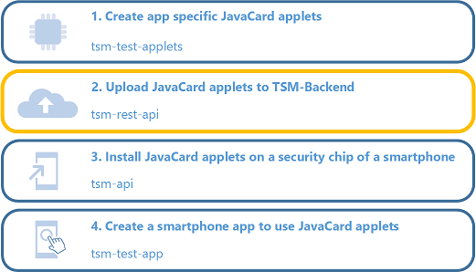
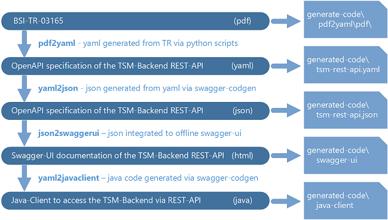
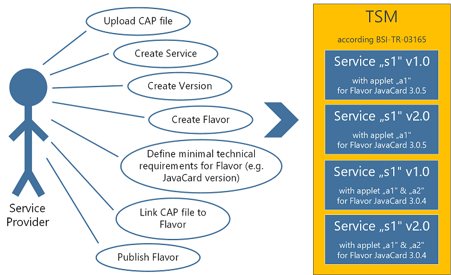
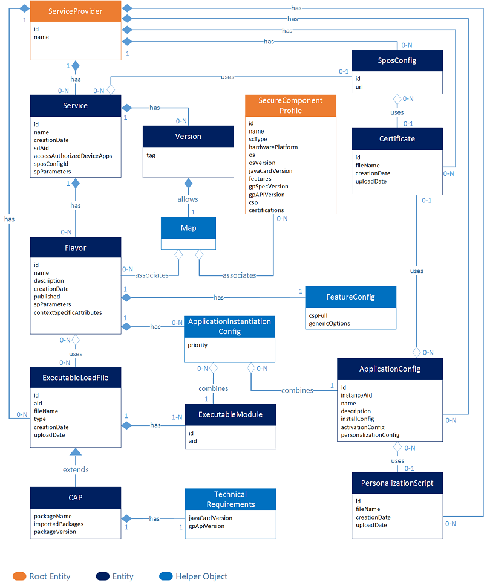

# TSM-REST-API

*Last updated: 07.06.2022*

The module **tsm-rest-api** is an OpenApi realization of the TSM-Backend REST-API specified in section 4.1 of [BSI-TR-03165](https://www.bsi.bund.de/DE/Themen/Unternehmen-und-Organisationen/Standards-und-Zertifizierung/Technische-Richtlinien/TR-nach-Thema-sortiert/tr03165/tr-03165.html). It is a submodule of [GitHub-BSI-TSMS](../README.md).

Swagger-ui documentation of latest TSM-REST-API: [tsm-rest-api.yaml](https://petstore.swagger.io/?url=https://raw.githubusercontent.com/BSI-Bund/TSMS/main/tsm-rest-api/dist/1.0.0/tsm-rest-api-1.0.0.yaml)


Content:

<ol>
  <li><a href="README.md#motivation">Motivation</a></li>
  <li><a href="README.md#project_results">Project Results</a></li>
  <li><a href="README.md#documentation">Documentation</a>
    <ol>
      <li><a href="README.md#project_structure">Project Structure</a>
        <ol>
            <li><a href="generate-code/pdf2yaml/README.md">pdf2yaml</a></li>
            <li><a href="generate-code/yaml2json/README.md">yaml2json</a></li>
            <li><a href="generate-code/json2swaggerui/README.md">json2swaggerui</a></li>
            <li><a href="generate-code/yaml2javaclient/README.md">yaml2javaclient</a></li>
        </ol>
      </li>
      <li><a href="README.md#code_generation">Code Generation</a></li>
      <li><a href="README.md#setup_development_environment">Setup Development Environment</a></li>
      <li><a href="README.md#build">Build the Project</a></li>
      <li><a href="README.md#usecases">Use Cases</a></li>
      <li><a href="README.md#datatypes">Data Types</a></li>
      <li><a href="README.md#api_methods">API methods</a></li>
    </ol>
  </li>
</ol>

<a name="motivation"></a>
## 1. Motivation

The provisioning of secure components usually relies on a Trusted Service Manager (TSM) which provides the necessary server structure for provisioning and holds the organisatoric and cryptographic access rights to the relevant parts of the secure component (not necessarily to the ISD). From a technical point of view, the TSM is an independent component in the TSMS, i.e. not directly connected to applications on the smartphone. To trigger actions like the provisioning or removal of applets, applications on the handset need to communicate to a backend system of the TSM. A prerequisite of this is that the applet in question has been made available to the TSM, including all relevant configuration information. 

Uploading JavaCard applets to a TSM-Backend and the configuration of Services via a dedicated API is step two in the usage path of BSI-TR-03165.



<a name="project_results"></a>
## 2. Project Results

The main result of this project is an OpenApi [tsm-rest-api.yaml](tsm-rest-api.yaml) file which specifies the REST-API to configure the TSM-Backend. Beside this, the projects provides scripts to generate additional supporting documents like documentation and transcripts of the API to other formats like JSON and Java. 

Latest official version: 1.0.0

The version numbering matches the versions of the BSI-TR-03165, i.e. TR-03165 in version a.b equates to tsm-rest-api-a.b.x. The last digit x is reserved for bugfixes applied on this project itself. 

Resulting build artifacts are:

* **[tsm-rest-api-1.0.0.yaml](dist/1.0.0/tsm-rest-api-1.0.0.yaml)**
  * OpenApi specification for the TSM-REST-API  
  * can be used for code generation with [swagger-codegen](https://swagger.io/tools/swagger-codegen)
  * can be visualized with [Swagger UI](https://swagger.io/tools/swagger-ui)
  * contains scheme definition for the data types used in TSM-Backend REST-API (compatible to xsd)
* **[tsm-rest-api-1.0.0.json](dist/1.0.0/tsm-rest-api-1.0.0.json)**
  * other format for OpenApi yaml file of the TSM-REST-API
* **[tsm-rest-api-1.0.0-swagger-ui.zip](dist/1.0.0/tsm-rest-api-1.0.0-swagger-ui.zip)**
  * offline Swagger UI documentation for TSM-REST-API
* **[generate-tsm-rest-api-java-client-1.0.0-pom.xml](dist/1.0.0/generate-tsm-rest-api-java-client-1.0.0-pom.xml)**
  * Maven definition file to configure [swagger-codegen](https://swagger.io/tools/swagger-codegen) to generate a java-client from the OpenApi yaml file
* **[tsm-rest-api-java-client-1.0.0.jar](dist/1.0.0/tsm-rest-api-java-client-1.0.0.jar)**
  * java library to access a TSM
  * can be integrated into a Java application
  * can be used to call REST-API methods of the TSM-Backend
  * provide default implementation for the data types required for TSM-Backend REST-API
  * generated via [swagger-codegen](https://swagger.io/tools/swagger-codegen) from tsm-rest-api.json
* **[tsm-rest-api-java-client-1.0.0-javadoc.jar](dist/1.0.0/tsm-rest-api-java-client-1.0.0-javadoc.jar)**
  * javadocs for the java-client
* **[tsm-rest-api-java-client-1.0.0-sources.jar](dist/1.0.0/tsm-rest-api-java-client-1.0.0-sources.jar)**
  * source code of the java-client


<a name="documentation"></a>
## 3. Documentation

<a name="project_structure"></a>
### 3.1 Project Structure

This project is separated into the following subfolders:

|**Folder**|**Description**|
|:----------|:----------|
|[<em>dist/</em>](dist/)|Contains resulting build artifacts of this project in several versions.|
|[<em>docs/</em>](docs/)|Contains a markdown documentation of the java-client for the TSM-Backend REST-API. All files in this folder are generated from the tsm-rest-api.|
|[<em>generate-code/</em>](generate-code/)|Contains Maven submodules with several subprojects to generate yaml, json, java and md files related to the TSM-Backend REST-API.|
|<em>generated-code/</em>|Contains resulting files when executing the code generation scripts.|


<a name="code_generation"></a>
### 3.2 Code Generation

This module generates definition files for an interface to access a TSM-Backend via a REST-API from the interface definition provided in the BSI-TR-03165. 

This project contains the following Maven submodules to generate files:

|**#**|**Submodule**|**Code Generation**|**Description**|
|:----|:----------|:----------|:----------|
|1.|[pdf2yaml](./generate-code/pdf2yaml/README.md)|pdf -> txt -> yaml|Generates an OpenApi yaml file from TR input.|
|2.|[yaml2json](./generate-code/yaml2json/README.md)|yaml -> json|Converts the OpenApi yaml file to an OpenApi json file.|
|3.|[json2swaggerui](./generate-code/json2swaggerui/README.md)|json -> html/js -> zip|Generates a Swagger-UI html/javascript documentation from the OpenApi json file.|
|4.|[yaml2javaclient](./generate-code/yaml2javaclient/README.md)|yaml -> java -> jar|Generates java classes from the OpenApi yaml file and compiles it to a jar.|

<br>



*Attention: Detailed documentation about each submodule can be found in the README of particular submodule.*


<a name="setup_development_environment"></a>
### 3.3 Setup Development Environment

Perform the following steps to set up a development environment to execute the code generators.
 
1. Install the following software

   |*Package*|*Package Name*|*Compatible Versions*|*Download Link*|
   |:------------------------|:-------------|:-------------|:-------------|
   |JDK|Java Development Kit| >= 1.8|https://openjdk.java.net/install/|
   |Maven|Apache Maven|>= 3.0.0|https://maven.apache.org/download.cgi|
   |Py|Python|>= 3.7|https://www.python.org/downloads/|
 
2. Configure Environment Variables

   |*Environment Variable*|*Path*|
   |:----------|:-------------|
   |*JAVA_HOME*|C:\Program Files\Java\jdk1.8.0|
   |*MVN_HOME*|C:\Program Files\ApacheMaven|
   |*PY_HOME*|C:\Program Files\Python\Python310|
   Adapt the paths in case you used other installation directories.<br><br>
   
3. Extend the Path Environment Variable

   |*PATH*|
   |:----------|
   |*%ANT_HOME%\bin*|
   |*%MVN_HOME%\bin*|
   |*%PY_HOME%\Scripts*|
   

4. Install Python extensions
   ```
   py -m pip install PyMuPDF
   py -m pip install fitz
   py -m pip install frontend
   py -m pip install tools
   ```

*Attention: Python is only required by the submodule pdf2yaml. The Python installation can be skipped, if pdf2yaml is excluded from the list of executed submodules (see 3.4).*


<a name="build"></a>
### 3.4 Build the Project
This project is a Maven aggregate project, which contains all generators described above. Use the following command to build all modules and with this to execute all code generators:

```
mvn clean install
```

The submodule *pdf2yaml* may be skipped in the generation process if the yaml file from the repository is used. In this case, Python is not required. The following command builds the project excluding  *pdf2yaml*:

```
mvn clean install --projects -:pdf2yaml
```

*Attention: Actually it is not needed to build this project. All final artifacts are already in the repository inside the [dist/](dist) folder.*


<a name="usecases"></a>
### 3.5 Use Cases

The TSM-Backend REST-API is an interface that provides methods for the following use cases:
* upload JavaCard *.cap files to TSM-Backend
* define a Service which consists of one or multiple *.cap files
* versionize the Service
* define Flavors (hardware variants) for each Service
* associate SecureComponentProfiles (hardware profiles) to each Flavor, e.g. minimal JavaCard version

In summary, the TSM-Backend REST-API is an administration interface for service providers to configure their Services in the TSM-Backend.



<a name="datatypes"></a>
### 3.6 Data Types

For the life-cycle management of secure applications, data provided by the respective SP has to be stored in the TSM-Backend. 

The central entity, the Service Provider is shown in orange. Class entities, like Service and Flavor, are shown in dark blue, while helper classes are shown in light blue. As the top-level entity, besides the Service Provider itself, a Service represents the functionality that should be provisioned onto a secure component. A Service may have different Flavors. Flavors are specific realizations of a Service. While the basic functionality is the same, different Flavors cover different characteristics and necessities of different underlying platforms. A Flavor comes with (typically) one or more Executable Load Files (ELFs). ELFs are containers of executable code on a secure component. A realization of a Load File is a Java Card CAP-File, which contains the Load File Data Block and, optionally, a manifest file that is used to retrieve information regarding the content of the CAP file. An ELF may contain several Executable Modules (EMs). An EM represents executable code on a secure component of a single application that can be used for the instantiation of application instances. An example of an Executable Module is a Java Card Applet.

These entities are augmented by various additional components. First of all, a Service has different Versions that can be used for versioning and updating. Other components cover specific requirements and configuration instructions for Flavors, ELFs, and EMs. E.g., during the installation process, the instantiation of application instances from an Executable Module is configured with the ApplicationInstantiationConfig, which itself relies on, respectively specifies, a more general ApplicationConfig.  PersonalizationScripts, e.g. for dynamic interactions between TSM-Backend and SP-Backend during the provisioning, add another (optional) layer of flexibility to the data model. The SecureComponentProfiles are managed by the TSM (thus shown in orange), they can be assigned to specific Flavors and are then mapped to Versions accordingly. 

Last but not least, the SposConfig is used to configure access to a SP backend for the delivery of order- and status management related data. A single SposConfig may be used by multiple Services.




<a name="api_methods"></a>
### 3.6 API Methods

All methods of the TSM-Backend REST-API are described in detail in BSI-TR-03165 Section 4.1. 

Additional documentation generated from the TR is available here:

* Online Swagger UI documentation: [tsm-rest-api.yaml](https://petstore.swagger.io/?url=https://raw.githubusercontent.com/BSI-Bund/TSMS/main/tsm-rest-api/dist/1.0.0/tsm-rest-api-1.0.0.yaml)
* Offline Swagger UI documentation: [tsm-rest-api-1.0.0-swagger-ui.zip](dist/1.0.0/tsm-rest-api-1.0.0-swagger-ui.zip)
* Java-Client documentation: [docs/README.md](docs/README.md)


The following table provides an overview about all available API methods. Section numbers refer to TR-03165.

|*Section*|*Description*|
|:----------|:-------------|
|[Authentication](./docs/AuthApi.md) | This section lists methods for authentication to the TSM Backend. <ul><li> POST [**createAccessToken**](./docs/AuthApi.md#createAccessToken)</li></ul> | 
|[Manage SP Account](./docs/ServiceprovidersApi.md) | This section lists methods for the management of SP account information. <ul><li> GET [**getAccountInformation**](./docs/ServiceprovidersApi.md#getAccountInformation)</li></ul> | 
|[Retrieve SecureComponentProfiles](./docs/SecureComponentProfilesApi.md) | This section provides methods to retrieve information about by the TSMS supported hardware platforms. <ul><li> GET [**listSecureComponentProfiles**](./docs/SecureComponentProfilesApi.md#listSecureComponentProfiles)</li><li> GET [**getSecureComponentProfile**](./docs/SecureComponentProfilesApi.md#getSecureComponentProfile)</li><li> GET [**listScpRelatedElfs**](./docs/SecureComponentProfilesApi.md#listScpRelatedElfs)</li><li> GET [**listScpRelatedServices**](./docs/SecureComponentProfilesApi.md#listScpRelatedServices)</li><li> GET [**listScpRelatedFlavors**](./docs/SecureComponentProfilesApi.md#listScpRelatedFlavors)</li><li> GET [**listScpRelatedVersions**](./docs/SecureComponentProfilesApi.md#listScpRelatedVersions)</li></ul> | 
|[Manage Services and Flavors](./docs/ServicesApi.md) | This section lists methods for the management of Services, Versions, and Flavors. Using these methods, an SP may, e.g., link existing ELFs and ApplicationConfigs to create and modify different Versions and Flavors of a Service. There are methods to list, create, modify, and delete Service entities and their corresponding Version and Flavor entities, and to link ExecutableModule entities and ApplicationConfig entities to a certain Flavor. The methods listed in this section do not provide functionality to upload binary data for ELFs or to create ApplicationConfigs. Uploading ELFs can be done via methods listed in Section 4.1.6.4.27. Managing ApplicationConfigs can be done via methods listed in Section 4.1.6.6. <ul><li> GET [**listServices**](./docs/ServicesApi.md#listServices)</li><li> POST [**createService**](./docs/ServicesApi.md#createService)</li><li> GET [**getService**](./docs/ServicesApi.md#getService)</li><li> PUT [**modifyService**](./docs/ServicesApi.md#modifyService)</li><li> DELETE [**deleteService**](./docs/ServicesApi.md#deleteService)</li><li> GET [**listFlavors**](./docs/ServicesApi.md#listFlavors)</li><li> POST [**createFlavor**](./docs/ServicesApi.md#createFlavor)</li><li> GET [**getFlavor**](./docs/ServicesApi.md#getFlavor)</li><li> PUT [**modifyFlavor**](./docs/ServicesApi.md#modifyFlavor)</li><li> DELETE [**deleteFlavor**](./docs/ServicesApi.md#deleteFlavor)</li><li> GET [**listServiceRelatedAppConfigs**](./docs/ServicesApi.md#listServiceRelatedAppConfigs)</li><li> GET [**listLinkedElfs**](./docs/ServicesApi.md#listLinkedElfs)</li><li> POST [**linkElfs**](./docs/ServicesApi.md#linkElfs)</li><li> PUT [**unlinkElfs**](./docs/ServicesApi.md#unlinkElfs)</li><li> POST [**publishFlavor**](./docs/ServicesApi.md#publishFlavor)</li><li> GET [**listServiceRelatedVersions**](./docs/ServicesApi.md#listServiceRelatedVersions)</li><li> GET [**listVersions**](./docs/ServicesApi.md#listVersions)</li><li> POST [**createVersion**](./docs/ServicesApi.md#createVersion)</li><li> GET [**getVersion**](./docs/ServicesApi.md#getVersion)</li><li> PUT [**modifyVersion**](./docs/ServicesApi.md#modifyVersion)</li><li> DELETE [**deleteVersion**](./docs/ServicesApi.md#deleteVersion)</li><li> GET [**listLinkedFlavors**](./docs/ServicesApi.md#listLinkedFlavors)</li><li> POST [**linkFlavors**](./docs/ServicesApi.md#linkFlavors)</li><li> PUT [**unlinkFlavors**](./docs/ServicesApi.md#unlinkFlavors)</li><li> GET [**listAssociatedSecureComponentProfiles**](./docs/ServicesApi.md#listAssociatedSecureComponentProfiles)</li><li> GET [**listLinkedSecureComponentProfiles**](./docs/ServicesApi.md#listLinkedSecureComponentProfiles)</li><li> POST [**linkSecureComponentProfiles**](./docs/ServicesApi.md#linkSecureComponentProfiles)</li><li> PUT [**unlinkSecureComponentProfiles**](./docs/ServicesApi.md#unlinkSecureComponentProfiles)</li></ul> | 
|[Manage ELFs and EMs](./docs/ExecutableLoadFilesApi.md) | This section lists methods for the upload of executable binary files, usually CAP files, and to provide technical requirements and installation orders for the EMs inside those files. There are methods to list, create, modify, upload, overwrite, and delete ExecutableLoadFile entities and their corresponding InstallationOrder and TechnicalRequirements entities. These methods do not provide functionality to link EMs to certain ApplicationConfigs. Linking EMs and ApplicationConfigs is done using methods listed in Section 4.1.6.4. <ul><li> GET [**listElfs**](./docs/ExecutableLoadFilesApi.md#listElfs)</li><li> POST [**createElfAndUploadBinary**](./docs/ExecutableLoadFilesApi.md#createElfAndUploadBinary)</li><li> GET [**getElf**](./docs/ExecutableLoadFilesApi.md#getElf)</li><li> PUT [**modifyElfAndOverwriteBinary**](./docs/ExecutableLoadFilesApi.md#modifyElfAndOverwriteBinary)</li><li> DELETE [**deleteElf**](./docs/ExecutableLoadFilesApi.md#deleteElf)</li><li> GET [**getElfBinary**](./docs/ExecutableLoadFilesApi.md#getElfBinary)</li><li> GET [**listEms**](./docs/ExecutableLoadFilesApi.md#listEms)</li><li> GET [**getEm**](./docs/ExecutableLoadFilesApi.md#getEm)</li><li> GET [**listElfRelatedAppConfigs**](./docs/ExecutableLoadFilesApi.md#listElfRelatedAppConfigs)</li><li> GET [**listElfRelatedFlavors**](./docs/ServicesApi.md#listElfRelatedFlavors)</li><li> GET [**listElfRelatedServices**](./docs/ExecutableLoadFilesApi.md#listElfRelatedServices)</li><li> GET [**listElfRelatedVersions**](./docs/ExecutableLoadFilesApi.md#listElfRelatedVersions)</li><li> GET [**listElfRelatedSecureComponentProfiles**](./docs/ExecutableLoadFilesApi.md#listElfRelatedSecureComponentProfiles)</li></ul> | 
|[Manage ApplicationConfigs](./docs/ApplicationConfigsApi.md) | This section lists methods to create application configurations for EMs. An ApplicationConfig consists of parameters and certificates necessary for the provisioning of a specific kind of SC. An ApplicationConfig does not depend on a specific EM. There are methods to list, upload, overwrite, and delete ApplicationConfigs, and to link PersonalizationScripts and Certificates to a certain ApplicationConfig. The methods listed here do not provide functionality to link ApplicationConfigs to certain EMs. Linking ApplicationConfigs and EMs is done via methods listed in Section 4.1.6.4. The methods listed here do not provide functionality to upload binary data for PersonalizationScripts or Certificates. Uploading those files is done via methods listed in Section 4.1.6.7 and Section 4.1.6.8. <ul><li> GET [**listAppConfigs**](./docs/ApplicationConfigsApi.md#listAppConfigs)</li><li> POST [**createAppConfig**](./docs/ApplicationConfigsApi.md#createAppConfig)</li><li> GET [**getAppConfig**](./docs/ApplicationConfigsApi.md#getAppConfig)</li><li> PUT [**modifyAppConfig**](./docs/ApplicationConfigsApi.md#modifyAppConfig)</li><li> DELETE [**deleteAppConfig**](./docs/ApplicationConfigsApi.md#deleteAppConfig)</li><li> GET [**listAppConfigRelatedEms**](./docs/ApplicationConfigsApi.md#listAppConfigRelatedEms)</li><li> GET [**listAppConfigRelatedFlavors**](./docs/ApplicationConfigsApi.md#listAppConfigRelatedFlavors)</li><li> GET [**listAppConfigRelatedServices**](./docs/ApplicationConfigsApi.md#listAppConfigRelatedServices)</li></ul> | 
|[Manage PersonalizationScripts](./docs/PersonalizationScriptsApi.md) | This section lists methods to upload and manage PersonalizationScripts. A PersonalizationScript is a binary script a SP may use to specify installation instructions or request TSM-support for, e.g., the personalization of a secure application during the provisioning process. A PersonalizationScript is independent of specific EMs and can be linked to an ApplicationConfig. There are methods to list, get, upload, and delete PersonalizationScripts. The methods listed here do not provide functionality to link a PersonalizationScript to an ApplicationConfig or EM. Linking a PersonalizationScript to an ApplicationConfig is done via methods listed in Section 4.1.6.6 , indirect linking to EMs is done via methods listed in Section 4.1.6.4. <ul><li> GET [**listPersoScripts**](./docs/PersonalizationScriptsApi.md#listPersoScripts)</li><li> POST [**createPersoScriptAndUploadBinary**](./docs/PersonalizationScriptsApi.md#createPersoScriptAndUploadBinary)</li><li> GET [**getPersoScript**](./docs/PersonalizationScriptsApi.md#getPersoScript)</li><li> PUT [**modifyPersoScriptAndOverwriteBinary**](./docs/PersonalizationScriptsApi.md#modifyPersoScriptAndOverwriteBinary)</li><li> DELETE [**deletePersoScript**](./docs/PersonalizationScriptsApi.md#deletePersoScript)</li><li> GET [**listScriptRelatedAppConfigs**](./docs/PersonalizationScriptsApi.md#listScriptRelatedAppConfigs)</li><li> GET [**getScriptBinary**](./docs/PersonalizationScriptsApi.md#getScriptBinary)</li><li> GET [**listScriptRelatedFlavors**](./docs/PersonalizationScriptsApi.md#listScriptRelatedFlavors)</li><li> GET [**listScriptRelatedServices**](./docs/PersonalizationScriptsApi.md#listScriptRelatedServices)</li></ul> | 
|[Manage Certificates](./docs/CertificatesApi.md) | This section lists methods to manage the TLS certificates which are used for communication with a SP backend requested by PersonalizationScripts (if applicable) and for communication between TSM and SPOS. There are methods to list, get, upload, and delete Certificates. The methods listed here do not provide functionality to link a Certificate to certain ApplicationConfigs or SposConfigs. Linking Certificates to ApplicationConfigs is done via methods listed in Section 4.1.6.6, and linking to SposConfigs is done using methods listed in Section 4.1.6.9. <ul><li> GET [**listCerts**](./docs/CertificatesApi.md#listCerts)</li><li> POST [**createCertAndUploadBinary**](./docs/CertificatesApi.md#createCertAndUploadBinary)</li><li> GET [**getCert**](./docs/CertificatesApi.md#getCert)</li><li> PUT [**modifyCertAndOverwriteBinary**](./docs/CertificatesApi.md#modifyCertAndOverwriteBinary)</li><li> DELETE [**deleteCert**](./docs/CertificatesApi.md#deleteCert)</li><li> GET [**listCertRelatedAppConfigs**](./docs/CertificatesApi.md#listCertRelatedAppConfigs)</li><li> GET [**getCertBinary**](./docs/CertificatesApi.md#getCertBinary)</li><li> GET [**listCertRelatedFlavors**](./docs/CertificatesApi.md#listCertRelatedFlavors)</li><li> GET [**listCertRelatedServices**](./docs/CertificatesApi.md#listCertRelatedServices)</li><li> GET [**listCertRelatedSposConfigs**](./docs/CertificatesApi.md#listCertRelatedSposConfigs)</li></ul> | 
|[Manage SposConfigs](./docs/SposConfigsApi.md) | This section lists methods to manage SposConfigs. <ul><li> GET [**listSposConfigs**](./docs/SposConfigsApi.md#listSposConfigs)</li><li> POST [**createSposConfig**](./docs/SposConfigsApi.md#createSposConfig)</li><li> GET [**getSposConfig**](./docs/SposConfigsApi.md#getSposConfig)</li><li> PUT [**modifySposConfig**](./docs/SposConfigsApi.md#modifySposConfig)</li><li> DELETE [**deleteSposConfig**](./docs/SposConfigsApi.md#deleteSposConfig)</li><li> GET [**listSposConfigRelatedServices**](./docs/SposConfigsApi.md#listSposConfigRelatedServices)</li></ul> | 


[Back to Overview](../README.md)
