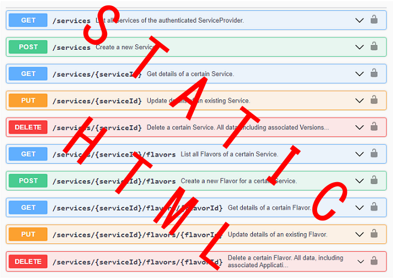

# json2swaggerui

*Last updated: 14.02.2022*

The module **json2swaggerui** is a small maven project to create an offline HTML documentation visualizing the TSM-Backend REST-API specified in section 4.1 of [BSI-TR-03165](https://www.bsi.bund.de/DE/Themen/Unternehmen-und-Organisationen/Standards-und-Zertifizierung/Technische-Richtlinien/TR-nach-Thema-sortiert/tr03165/tr-03165.html). It is part of the code-generation submodules from [TSM-REST-API](../../README.md).


Content:

<ol>
  <li><a href="README.md#motivation">Motivation</a></li>
  <li><a href="README.md#project_results">Project Results</a></li>
  <li><a href="README.md#documentation">Documentation</a>
    <ol>
      <li><a href="README.md#project_structure">Project Structure</a>
      <li><a href="README.md#build">Build the Project</a></li>
      <li><a href="README.md#static_swaggerui">Static Swagger UI</a></li>
    </ol>
  </li>
</ol>

<a name="motivation"></a>
## 1. Motivation

The TSM-Backend REST-API is already available as [OpenAPI](https://www.openapis.org/) JSON definition file. It can be visualized using the tool [Swagger UI](https://swagger.io/tools/swagger-ui/).

On default configuration, Swagger UI requires a server to run it. So, to view the documentation, it is needed either to start a local Swagger UI server instance or to use one from the internet.

The goal of this project is to provide an offline variant for Swagger UI showing the concrete TSM-Backend REST-API.




<a name="project_results"></a>
## 2. Project Results

The result of this project is a zip file containing static HTML and JavaScript files  documenting the TSM-Backend REST-API. 

Offline Swagger UI documentations of the TSM-Backend REST-API are available for certain official versions of BSI-TR-03165 and are located in the [dist](../../dist) folder of the parent project TSM-REST-API. Naming convention is as follows:

```
../../dist/${VERSION}/tsm-test-api-${VERSION}-swagger-ui.zip
```


<a name="documentation"></a>
## 3. Documentation

<a name="project_structure"></a>
### 3.1 Project Structure

The project contains a Maven pom.xml file which performs necessary steps to create an offline Swagger UI documentation from an OpenApi JSON file. 


<a name="build"></a>
### 3.2 Build the Project

Perform the following steps to set up a development environment to build the project.
 
1. Install Apache Maven >= 3.0.0

2. Build the maven project
  ```
  mvn clean install
  ```

*Attention: Actually it is not needed to build this project. All final artifacts are already in the repository inside the [dist](../../dist) folder.*

<a name="static_swaggerui"></a>
### 3.3 Static Swagger-UI

Prerequisites: an OpenApi specification of a REST-API must be available in form of a JSON file.

1. First, the OpenAPI JSON is converted to JavaScript.<br>
  The *.json file is renamed to *.js file. Its content is changed to JavaScript format by adding a variable definition and assigning the JSON content to the variable:
  ```
  var spec = { "openapi" : "3.0.0", ... }
  ```

2. Second, the official Swagger UI is downloaded from the [Maven Central Repository](https://mvnrepository.com/artifact/org.webjars.npm/swagger-ui-dist) and extracted to local directory.
  ```
  <groupId>org.webjars.npm</groupId>
  <artifactId>swagger-ui-dist</artifactId>
  ```

3. Then, the index.html inside the swagger-ui-dist directory is modified to import the JavaScript JSON file:
  ```xml
  <replacement>
    <token>
      <![CDATA[<link rel="icon" type="image/png" href="./favicon-16x16.png" sizes="16x16" />]]>
    </token>
    <value>
      <![CDATA[<link rel="icon" type="image/png" href="./favicon-16x16.png" sizes="16x16" />
      <script src='openapi.js' type="text/javascript"></script>]]>
    </value>
  </replacement>
  ```
  ... and the new variable is used as JSON content:
  ```
  <replacement>
    <token>
      <![CDATA[const ui = SwaggerUIBundle\(\{
    url: "https://petstore.swagger.io/v2/swagger.json",]]>
  </token>
  <value>
      <![CDATA[const ui = SwaggerUIBundle({
    url: "tsm-rest-api-${project.version}.yaml",
    spec: spec,]]>
    </value>
  </replacement>
  ```
4. Finally, a new zip file is created containing the modified files.


[Back to TSM-REST-API](../../README.md)
