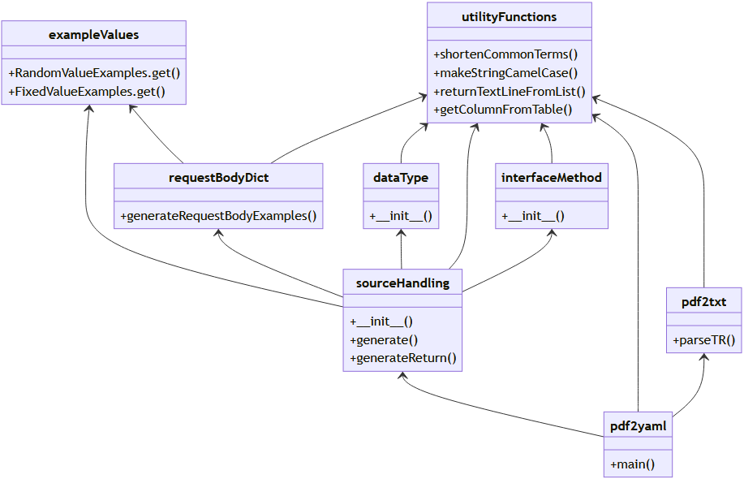
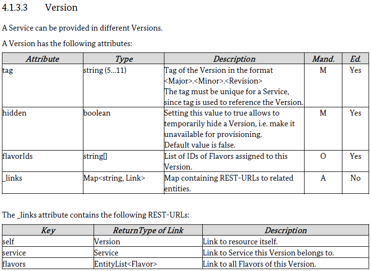
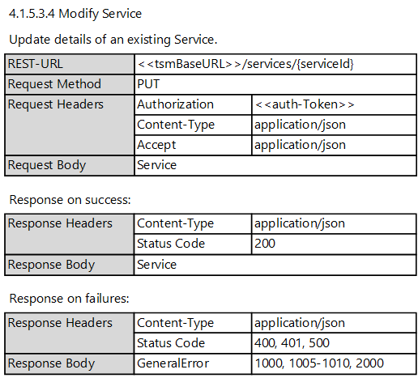

# pdf2yaml

*Last updated: 14.02.2022*

The module **pdf2yaml** is a collection of Python scripts to transform the TSM-Backend REST-API described in the PDF [BSI-TR-03165](https://www.bsi.bund.de/DE/Themen/Unternehmen-und-Organisationen/Standards-und-Zertifizierung/Technische-Richtlinien/TR-nach-Thema-sortiert/tr03165/tr-03165.html) to an [OpenApi 3.0.0](https://spec.openapis.org/oas/v3.0.0) YAML file. 
This project is part of the code-generation submodules from [TSM-REST-API](../../README.md).

Content:

<ol>
  <li><a href="README.md#motivation">Motivation</a></li>
  <li><a href="README.md#project_results">Project Results</a></li>
  <li><a href="README.md#documentation">Documentation</a>
    <ol>
      <li><a href="README.md#project_structure">Project Structure</a>
      <li><a href="README.md#setup_development_environment">Setup Development Environment</a></li>
      <li><a href="README.md#build">Run the Scripts</a></li>
      <li><a href="README.md#class_diagram">Class Diagram</a></li>
      <li><a href="README.md#example_workflow_datatype">Example Workflow for a Datatype</a></li>
      <li><a href="README.md#example_workflow_method">Example Workflow for a Method</a></li>
    </ol>
  </li>
</ol>

<a name="motivation"></a>
## 1. Motivation

The [BSI-TR-03165](https://www.bsi.bund.de/DE/Themen/Unternehmen-und-Organisationen/Standards-und-Zertifizierung/Technische-Richtlinien/TR-nach-Thema-sortiert/tr03165/tr-03165.html) defines a REST-API. Since the TR is a PDF file, it is not easy to use it for further automated data processing. This project provides Python scripts to create an OpenApi definition file of the REST-API described in the TR, which then can be used for further code processing like creating documentation or software clients to use the API for automated processes.


<a name="project_results"></a>
## 2. Project Results

The result of this project is a tsm-rest-api.yaml file, which is stored in the parent TSM-REST-API project:

* [tsm-rest-api.yaml](../../tsm-rest-api.yaml)

<a name="documentation"></a>
## 3. Documentation

<a name="project_structure"></a>
### 3.1 Project Structure

The project contains the following files and folders:

|*File*|*Description*|
|:----------|:---------------|
|[src](src/)|Python scripts.|
|[pdf](pdf)|Input files used for YAML file generation.|
|[pdf/source_header.yaml](pdf/source_header.yaml)|Manually written YAML header.|
|[pdf/source_components_requestBodies.yaml](pdf/source_components_requestBodies.yaml)|Manually written request bodies section.|
|[pdf/source_components_responses.yaml](pdf/source_components_responses.yaml)|Manually written responses section.|
|[pdf/source_components_securitySchemes.yaml](pdf/source_components_securitySchemes.yaml)|Manually written security schemes section.|
|[pdf/source_components_schemas_separate.yaml](pdf/source_components_schemas_separate.yaml)|Manually written scheme section part, only containing authToken-scheme, which is not included in the TR as an explicit scheme, but rather as a security token.|
|[pdf/TR-TSMS_V{$VERSION}_{$DATE}.pdf](pdf/TR-TSMS_V1.0_20220603.pdf)|Original PDF document of BSI-TR-03165 with actual version and date in name.|
|[pdf/TR-TSMS_V{$VERSION}_{$DATE}.txt](pdf/TR-TSMS_V1.0_20220603.txt)|Extracted text of respective PDF document with same name.|
|[pdf/tr_03165_source.txt](pdf/tr_03165_source.txt)|Content of extracted text document used in last run.|

<a name="setup_development_environment"></a>
### 3.2 Setup Development Environment

Perform the following steps to set up a development environment to use the Python scripts to generate an OpenApi YAML file from TR input.

1. Install the following software

   |*Package*|*Package Name*|*Compatible Versions*|*Download Link*|
   |:------------------------|:-------------|:-------------|:-------------|
   |Py|Python|>= 3.7|Linux:<br>`sudo apt install python3 python3-testresources pip`<br>Windows:<br>`choco install python3` (admin mode) or<br>https://www.python.org/downloads/|

2. Install required Python extensions
	```
	 py -m pip install PyMuPDF
	 py -m pip install fitz
	```

<a name="build"></a>
### 3.3 Run the Scripts

Perform the following steps to run the scripts:

1. __Get PDF BSI-TR-03165 and provide it as input:__
	* download from: [https://www.bsi.bund.de/[...]/TR-nach-Thema-sortiert/tr03165/tr-03165.html](https://www.bsi.bund.de/DE/Themen/Unternehmen-und-Organisationen/Standards-und-Zertifizierung/Technische-Richtlinien/TR-nach-Thema-sortiert/tr03165/tr-03165.html)
	* use original PDF of the TR and store it with `<Major>.<Minor>` based version and current date to `./pdf/TR-TSMS_V<Major>.<Minor>_<YYYY><MM><DD>.pdf`

2. __Call of Python-Program (standalone):__
	* open cmd
	* change directory to main folder (`./pdf2yaml`)
	* call pdf2yaml.py (execution time around 0.5s)
	```
	 cd ./generate-code/pdf2yaml
	 py ./src/pdf2yaml.py
	```

3. __Optional script parameters:__
	* use `latest` as parameter to select the latest available PDF document by date (this option is used in the Maven script)
	* use the main program without parameters, also defaulting to the latest available PDF version
	* you can parse earlier PDF versions by passing the respective date (`<YYYYMMDD>`)
	* when you specify a faulty date-parameter (e.g. `2013456`) or the date you were looking for is missing, the last version used will be selected (saved as `./pdf/tr_03165_source.txt`); this is used as a stable backup option
	* even a call by absolute path (e.g. `python C:\Users\<NAME>\Documents\Python\pdf2yaml\src\pdf2yaml.py 20211122`) without cd in step 2 is possible, the current working directory is changed in the python main routine for the sake of robustness

4. __Configure correct version of TR for maven integration:__
   * Maven will default to the latest available PDF version
   * make sure that at least the file with the latest version has valid content; else invalid output may be generated
   * in case of deviating purposes, the Python parameter in `pdf2yaml/pom.xml` has to be adjusted to the desired date

*Attention: Actually, it is not needed to run the python scripts. The final YAML file is already available in the repository at [../../tsm-rest-api.yaml](../../tsm-rest-api.yaml).*


<a name="class_diagram"></a>
### 3.4  Class Diagram

The following class diagram shows the structure of the Python scripts of pdf2yaml. It separates different program parts to ensure the maintainability of the overall solution. This means that individual functionalities can be accessed in a targeted manner to make them easier to overview and adapt. In addition, each source file offers a test routine to test the most important contents to a limited scope.



__utilityFunctions:__

* generally useful functions, stored in a utility module
* necessary to handle the basic level of text processing

__exampleValues:__

* provides general example values for different formats (UUID, AID, TLV, names, boolean, int, ...)
* contains random and fixed example generating process with same interface `get(<TYPE>)`

__requestBodyDict:__

* examples for request bodies are generated in this module
* mode of random or fixed examples can be chosen

__dataType:__

* object definition to store data types of the Rest-API
* used to create schemas-section in OpenApi YAML

__interfaceMethod:__

* object definition to store methods of the Rest-API
* used to create paths-section in OpenApi YAML

__sourceHandling:__

* handles objects that contain relevant information of the source material
* behaves indifferent to chosen source method
* no direct call to pdf2txt, because the resulting TXT is saved by the parser and loaded later
* sequence coordination is carried out by pdf2yaml

__pdf2txt:__

* automatic PDF extraction is done here
* text manipulation is kept to a minimum to ensure a correct result with concurrent performance
* done in around 0.3s, versus 4 min in manual copy-paste-extraction

__pdf2yaml:__

* central point of access from outside
* called as main routine, handling user input


<a name="example_workflow_datatype"></a>
### 3.5. Example workflow for datatype

This section shows an example how pdf2yaml converts a datatype definition from BSR-TR-03165 PDF to a model entity in OpenApi YAML format.

1. Use PDF of TR-03165 as input, view snippet below:

    
    
2. Content is parsed with python and saved to txt file with same name as pdf, same snippet below:

    ```text
    4.1.3.3 Version
    A Service can be provided in different Versions.
    A Version has the following attributes:
    Attribute
    Type
    Description
    Mand.
    Ed.
    tag
    string (5…11)
    Tag of the Version in the format
    <Major>.<Minor>.<Revision>
    The tag must be unique for a Service, since tag is used to reference the Version.
    M
    Yes
    hidden
    boolean
    Setting this value to true allows to temporarily hide a Version, i.e. make it unavailable for provisioning.
    Default value is false.
    M
    Yes
    flavorIds
    string[]
    List of IDs of Flavors assigned to this Version.
    O
    Yes
    _links
    Map<string, Link>
    Map containing REST-URLs to related entities.
    A
    No
    The _links attribute contains the following REST-URLs:
    Key
    ReturnType of Link
    Description
    self
    Version
    Link to resource itself.
    service
    Service
    Link to Service this Version belongs to.
    flavors
    EntityList<Flavor>
    Link to all Flavors of this Version.
    ```

3. Finally the script converts text information to yaml structure, resulting in the following output from the previous snippet:

    ```yaml
    ### 4.1.3.3 ###
      Version:
        description: "A Service can be provided in different Versions."
        type: object
        required: [tag, hidden]
        properties:
          tag: # M, Yes
            description: "Tag of the Version in the format <Major>.<Minor>.<Revision> The tag must be unique for a Service, since tag is used to reference the Version."
            type: string
            format: version
            maxLength: 11
            minLength: 5
            example: "3.1.4"
          hidden: # M, Yes
            description: "Setting this value to true allows to temporarily hide a Version, i.e. make it unavailable for provisioning. Default value is false."
            type: boolean
            default: false
          flavorIds: # O, Yes
            description: "List of IDs of Flavors assigned to this Version."
            type: array
            items:
              type: string
              format: uuid
            example: [ "5dc9a676-847d-2606-bc15-fc8eea036be0", "00f5cc8a-f5c7-3929-682f-8eef5972f55a", "615c1678-895b-ff21-7c6c-bcd9fed11b84" ]
          _links: # A, No
            description: "Map containing REST-URLs to related entities."
            type: object
            additionalProperties:
              type: string
              format: uri
              maxLength: 500
            readOnly: true
            example:
              self: Link to resource itself.
              service: Link to Service this Version belongs to.
              flavors: Link to all Flavors of this Version.
    ```


<a name="example_workflow_method"></a>
### 3.6. Example workflow for a method

This section shows an example how pdf2yaml converts a  method definition from BSR-TR-03165 PDF to a REST method in OpenApi YAML format.

1. Use pdf of TR-03165 as input, view snippet below:

    

2. Content is parsed with python and saved to txt file with same name as pdf, same snippet below:

    ```txt
    4.1.5.3.4 Modify Service
    Update details of an existing Service.
    REST-URL
    <<tsmBaseURL>>/services/{serviceId}
    Request Method
    PUT
    Request Headers
    Authorization
    <<auth-Token>>
    Content-Type
    application/json
    Accept
    application/json
    Request Body
    Service
    Response on success:
    Response Headers
    Content-Type
    application/json
    Status Code
    200
    Response Body
    Service
    Responses on failures:
    Response Headers
    Content-Type
    application/json
    Status Code
    400, 401, 500
    Response Body
    GeneralError
    1000, 1005-1010, 2000
    ```

3. Finally the script converts text information to yaml structure, resulting in the following output from the previous snippet:

    ```yaml
    ### 4.1.5.3.4 Modify Service ###
      #/services/{serviceId}:
        put:
        tags:
        - /services
        summary: Update details of an existing Service.
        description: Update details of an existing Service.
        operationId: putServicesByServiceId
        ##### Request Headers: 
        security:
          - authToken: []
        ##### Accept: application/json
        requestBody:
          required: true
          content:
          application/json:
            schema:
            $ref: '#/components/schemas/Service'
            example:
            name: "Name of the Service."
            accessAuthorizedDeviceApps: "List of apps for which an access rule is created when an instance of this Service is activated."
            sposConfigId: "ID of the SposConfig used for this Service."
            spParameters: "Key value definitions used as parameters of a service. Those parameters can be can be retrieved via TSM-API. The parameters can be overwritten for each Flavor."
        ##### Service: 
        parameters:
        - $ref: '#/components/parameters/serviceId'
        responses:
          200:
          description: Ok
          content:
            application/json:
            schema:
              $ref: '#/components/schemas/Service'
          400:
          $ref: '#/components/responses/400Error_1005_1006_1007_1008_1009_1010'
          401:
          $ref: '#/components/responses/401Error_1000'
          500:
          $ref: '#/components/responses/500Error_2000'
    ```

[Back to TSM-REST-API](../../README.md)
